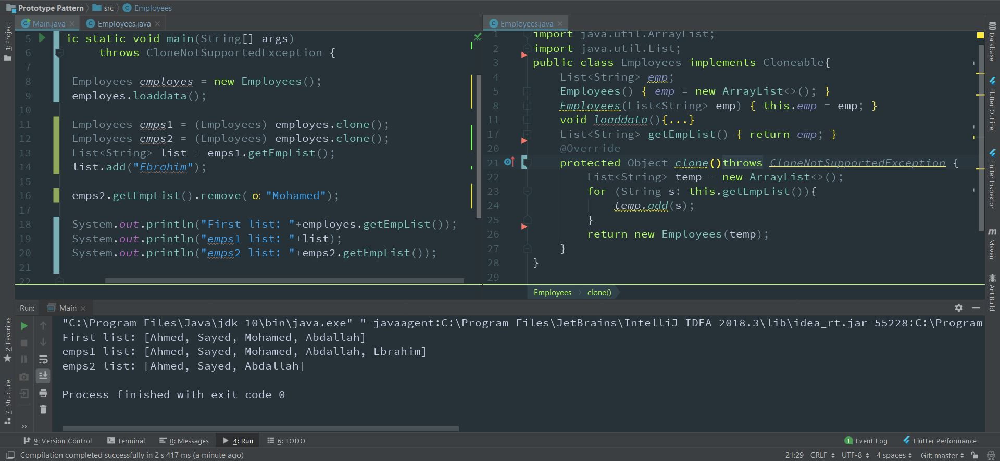

### Pattern Prototype

Prototype pattern is one of the Creational Design pattern, so it provides a mechanism of object creation. Prototype pattern is used when the Object creation is a costly affair and requires a lot of time and resources and you have a similar object already existing. So this pattern provides a mechanism to copy the original object to a new object and then modify it according to our needs. This pattern uses Java cloning to copy the object.

### Screenshot of the Full code 


```java

import java.util.ArrayList;
import java.util.List;
public class Users implements Cloneable{
    private List<String> empList;

    public Users(){

      empList = new ArrayList<>();
      }

public Users(List<String> list){
this.empList=list;
}

//read some data from the database.
public void loadData(){
    empList.add("japak");
    empList.add("King");
    empList.add("David");
    empList.add("Romeo");
}

public List<String> getEmpList() {
    return empList;
}

  @Override
  public Object clone() throws CloneNotSupportedException{
        List<String> temp = new ArrayList<String>();
        for(String s : this.getEmpList()){
          temp.add(s);
          }
          return new Users(temp);
}
}

 //Notice that the clone method is overridden to provide a deep copy of the users list.
```

Here's the program that will show the benefit of the Prototype pattern usage.

```java
public class PrototypePatternTest {
  public static void main(String[] args) throws CloneNotSupportedException {
        Users usr = new Users();
          user.loadData();
//Use the clone method to get the User object
        Users useNew = (Users) user.clone();
        Users useNew1 = (Users) user.clone();
        List<String> list = useNew.getEmpList();
        list.add("John");

        List<String> list1 = usersNew1.getEmpList();
        list1.remove("Pankaj");
        System.out.println("users List: "+ users.getEmpList());
        System.out.println("users New List: "+list);
        System.out.println("users New1 List: "+list1);
      }
}
```

